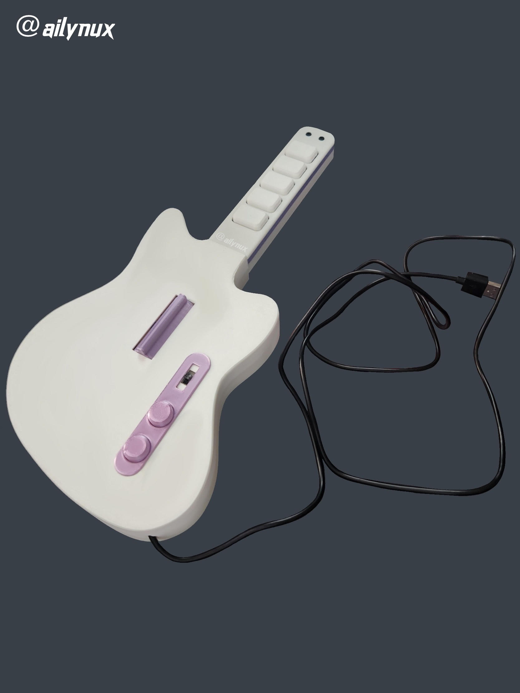
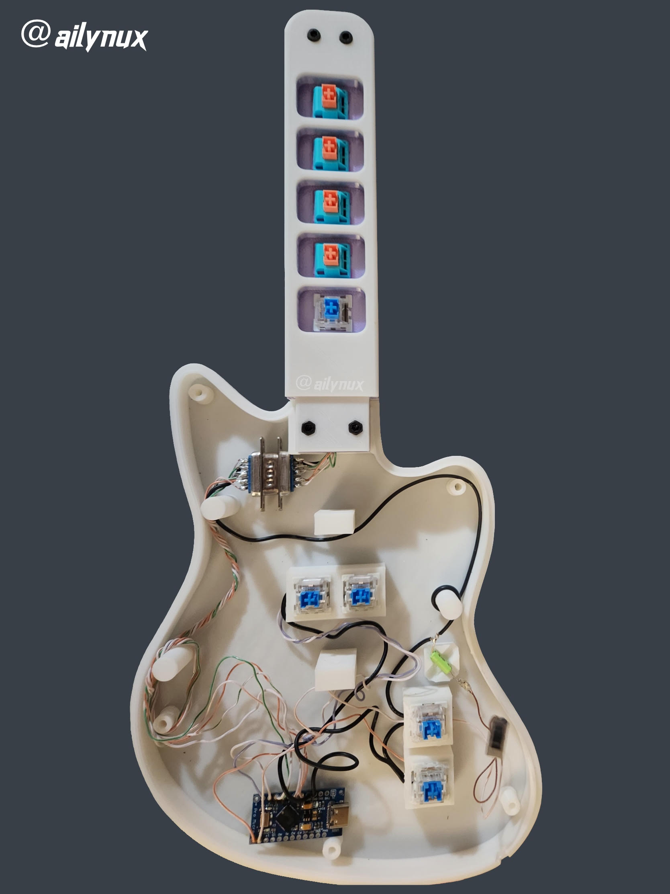

# 🎸 ʍɨռɨ ɢʊɨȶǟʀ ɦɛʀօ ƈօռȶʀօʟʟɛʀ
<h3 align="center">【３Ｄ　Ｐｒｉｎｔｅｄ　Ｃｕｓｔｏｍ】</h3>

  

---

## 🛠️ Overview

A **3D-printed mini Guitar Hero controller**, built from scratch using a combination of **custom wiring**, **Arduino programming**, and **MX Cherry switches**. This project will guide you step by step on how to create your own custom Guitar Hero controller with a working tilt sensor!

---

## ⛏️ Built Using
- CAT5 Cable
- 9 Switches (MX Cherry or Kaihl switches)
- Steel ball tilt sensor
- 1x 2 or 3 post switch (toggles the tilt sensor)
- Arduino Pro Micro
- M3 Bolt Screws
- Thin gauge copper wire
- Serial Cable Male + Female
- Solder

---

<h2 align="center"> 🎀 𝒮𝒯𝐸𝒫𝒮 🎀 </h2>

  

1. **Download all necessary STL files.**
2. **Gather your materials.** Ensure you have everything from the list.
3. **Solder the frets first.** This will give you a solid starting point.
4. **Wire a common ground** to all fret switches and components.
5. **Solder the CAT5 cable** to each switch. Use individual wires for each connection.
6. **Connect the CAT5 cables** from the frets and the ground cable to the Serial Connector.
7. **Ensure the Serial ends match up** for proper signal transmission, then continue soldering.
8. **Solder each individual input switch** into the Arduino Pro Micro’s designated # pin holes.
9. **Wire the faceplate switch** to toggle the tilt sensor on and off.
10. **Interrupt the positive lead** going to the tilt sensor with the toggle switch.
11. **Program the Arduino Pro Micro.** Upload your code and test functionality.

---

## 🧰 The Wiring Job

  

---

## 🌐 Resources & Links

- [Guitar Configurator by Sanjay900](https://sanjay900.github.io/guitar-configurator/)
- [MiniCaster MIDI Controller Design on Printables](https://www.printables.com/model/479046-minicaster-mini-clone-heromidi-controller)
- [YouTube Tutorial on Building a Guitar Hero Controller](https://www.youtube.com/watch?v=4ONCGFa3iXM&t=608s)

---

## ❤️ Future Enhancements & Acknowledgments

- Implement additional LED lights for visual feedback during gameplay.
- Add haptic feedback motors for an immersive feel when strumming or hitting notes.
- Special thanks to the open-source community for the great tools and tutorials!

  

---

## 🏆 Stay Connected!
If you loved this project or have questions, feel free to reach out!

