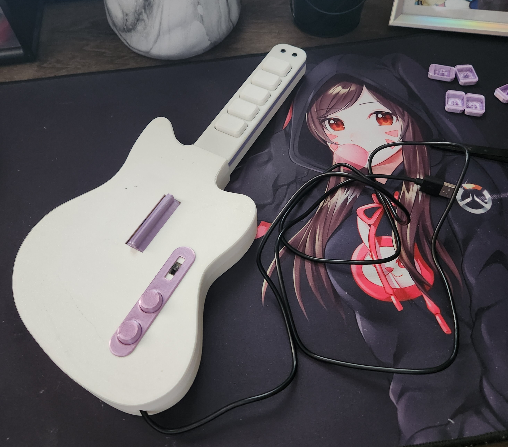
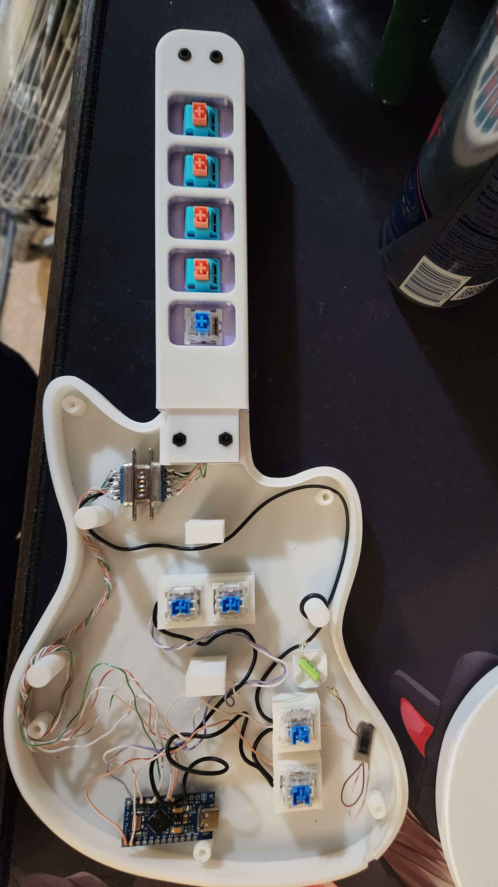

<h1 align="center">ᴍɪɴɪ ɢᴜɪᴛᴀʀ ʜᴇʀᴏ ᴄᴏɴᴛʀᴏʟʟᴇʀ</h1>
<h3 align="center">【３Ｄ　Ｐｒｉｎｔｅｄ　Ｃｕｓｔｏｍ】</h3>

  

# ⛏️ Built Using
- CAT5 Cable
- 9 Switches (MX Cherry or Kaihl switches)
- Steel ball tilt sensor
- 1x 2 or 3 post switch (toggles the tilt sensor)
- Arduino Pro Micro
- M3 Bolt Screws
- Copper wire thin gauge
- Serial Cable Male + Female
- Solder 

<h2 align="center"> ▀▄▀▄▀▄   🎀  𝒮𝒯𝐸𝒫𝒮  🎀   ▄▀▄▀▄▀ </h2>
  

  

<li>
 <b>1:</b> Download all the STL files you will need.</li>
<li>
<b>2:</b> Gather Materials together. 
</li>
<li>
<b>3:</b> Solder the Fret first.
</li>
<li>
<b>4:</b> Wire a common ground to all pins.
</li>
<li>
<b>5:</b> Solder the CAT5 cable to each switch. 
</li>
<li>
<b>6:</b> Solder the CAT5 from the frets and the grounding cable to the Serial Connector. 
</li>
<li>
<b>7:</b> The Serial ends should match up continue to solder the following switches. 
</li>
<li>
<b>8:</b> Run a positive wire from each individual input switch, solder into any of the # holes on the Pro Micro. 
</li>
<li>
<b>9:</b> Switch on the faceplate is used to toggle the tilt sensor. 
</li>
<li>
<b>10:</b> Interrupt the positive lead going to the sensor insert the toggle switch there. 
</li>
<li>
<b>11:</b> Program micro controller. 
</li>
   

  
<h2 align="center">░THE░ ░WIRING░ ░JOB░</h2>

  

  
<h2 align="center">(っ◔◡◔)っ ♥ </h2>
  

    
# Future links + Acknowledgements
- https://clonehero.net/releases/v1.0.0.4080/
* https://sanjay900.github.io/guitar-configurator/
+ https://www.printables.com/model/479046-minicaster-mini-clone-heromidi-controller
- https://www.youtube.com/watch?v=4ONCGFa3iXM&t=608s
